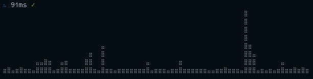
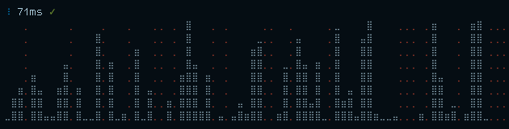

# ping-graph

> Graphs pings in the terminal

```
$ ping-graph

⠙ 101ms ✓
                                               ⣿
                                               ⣿
                                               ⣿
                                               ⣿
            ⣤                                  ⣿⣶
         ⣶  ⣿                                  ⣿⣿⣤
  ⣤⣶    ⣿⣿  ⣿          ⣤       ⣶               ⣿⣿⣿      ⣤
⣤⣶⣿⣿⣶⣶⣶⣶⣿⣿⣶⣤⣿⣶⣶⣤⣶⣶⣶⣶⣶⣶⣶⣿⣤⣶⣶⣶⣤⣶⣶⣿⣶⣶⣶⣶⣶⣶⣤⣤⣶⣶⣿⣶⣶⣶⣤⣿⣿⣿⣤⣶⣤⣶⣤⣶⣿⣶⣶⣿⣶⣿⣶
```

## Usage

```
npm install -g github:rstacruz/ping-graph
```

```sh
# Pings 8.8.8.8 every 1 second by default
ping-graph

# You can configure it
ping-graph 208.67.220.220 --interval 2

# For more info, see:
ping-graph --help
```

## Screenshots

On a good day, it looks like this:



On a bad day, timeouts show up as red:



## Thanks

**ping-graph** © 2017, Rico Sta. Cruz. Released under the [MIT] License.<br>
Authored and maintained by Rico Sta. Cruz with help from contributors ([list][contributors]).

> [ricostacruz.com](http://ricostacruz.com) &nbsp;&middot;&nbsp;
> GitHub [@rstacruz](https://github.com/rstacruz) &nbsp;&middot;&nbsp;
> Twitter [@rstacruz](https://twitter.com/rstacruz)

[](https://github.com/rstacruz) &nbsp;
[](https://twitter.com/rstacruz)

[MIT]: http://mit-license.org/
[contributors]: http://github.com/rstacruz/ping-graph/contributors
